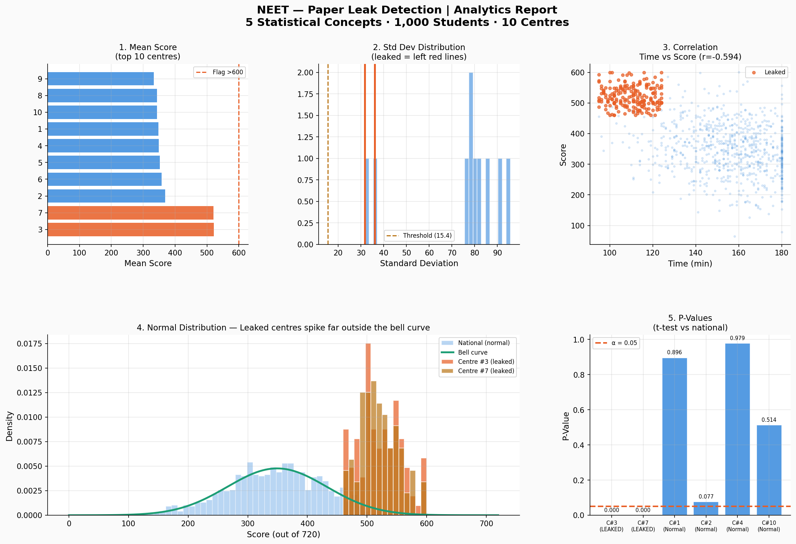

# NEET Paper Leak Detection | Statistical Analysis

Analysed simulated NEET exam data to detect fraudulent centres 
using 5 statistical concepts.

## What I built
- Simulated 1,000 students across 10 exam centres
- Hid fraud in 2 centres using realistic score and time patterns
- Used statistics to surface them without any labels

## Methods Used
- Mean / Median analysis
- Standard Deviation
- Correlation (Pearson r)
- Normal Distribution (Shapiro-Wilk)
- Hypothesis Testing (Welch's T-test)

## Result
Both compromised centres flagged correctly.  
Precision: 100% | Recall: 100% | F1: 1.0

## Tools
Python | pandas | numpy | scipy | matplotlib

## Dashboard

